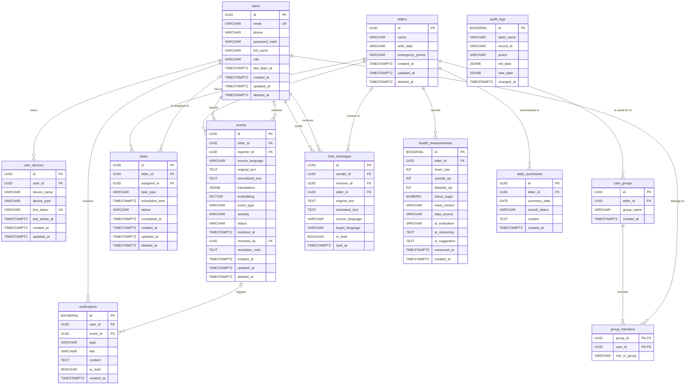

```mermaid
erDiagram
    users {
        UUID id PK
        VARCHAR email UK
        VARCHAR phone
        VARCHAR password_hash
        VARCHAR full_name
        VARCHAR role
        TIMESTAMPTZ last_login_at
        TIMESTAMPTZ created_at
        TIMESTAMPTZ updated_at
        TIMESTAMPTZ deleted_at
    }

    elders {
        UUID id PK
        VARCHAR name
        VARCHAR birth_date
        VARCHAR emergency_phone
        TIMESTAMPTZ created_at
        TIMESTAMPTZ updated_at
        TIMESTAMPTZ deleted_at
    }

    user_devices {
        UUID id PK
        UUID user_id FK
        VARCHAR device_name
        VARCHAR device_type
        VARCHAR fcm_token UK
        TIMESTAMPTZ last_active_at
        TIMESTAMPTZ created_at
        TIMESTAMPTZ updated_at
    }

    care_groups {
        UUID id PK
        UUID elder_id FK
        VARCHAR group_name
        TIMESTAMPTZ created_at
    }

    group_members {
        UUID group_id PK, FK
        UUID user_id PK, FK
        VARCHAR role_in_group
    }

    tasks {
        UUID id PK
        UUID elder_id FK
        UUID assigned_to FK
        VARCHAR task_type
        TIMESTAMPTZ scheduled_time
        VARCHAR status
        TIMESTAMPTZ completed_at
        TIMESTAMPTZ created_at
        TIMESTAMPTZ updated_at
        TIMESTAMPTZ deleted_at
    }

    events {
        UUID id PK
        UUID elder_id FK
        UUID reporter_id FK
        VARCHAR source_language
        TEXT original_text
        TEXT normalized_text
        JSONB translations
        VECTOR embedding
        VARCHAR event_type
        VARCHAR severity
        VARCHAR status
        TIMESTAMPTZ resolved_at
        UUID resolved_by FK
        TEXT resolution_note
        TIMESTAMPTZ created_at
        TIMESTAMPTZ updated_at
        TIMESTAMPTZ deleted_at
    }

    chat_messages {
        UUID id PK
        UUID sender_id FK
        UUID receiver_id FK
        UUID elder_id FK
        TEXT original_text
        TEXT translated_text
        VARCHAR source_language
        VARCHAR target_language
        BOOLEAN is_read
        TIMESTAMPTZ sent_at
    }

    health_measurements {
        BIGSERIAL id PK
        UUID elder_id FK
        INT heart_rate
        INT systolic_bp
        INT diastolic_bp
        NUMERIC blood_sugar
        VARCHAR meal_context
        VARCHAR data_source
        VARCHAR ai_evaluation
        TEXT ai_reasoning
        TEXT ai_suggestion
        TIMESTAMPTZ measured_at
        TIMESTAMPTZ created_at
    }

    daily_summaries {
        UUID id PK
        UUID elder_id FK
        DATE summary_date
        VARCHAR overall_status
        TEXT content
        TIMESTAMPTZ created_at
    }

    notifications {
        BIGSERIAL id PK
        UUID user_id FK
        UUID event_id FK
        VARCHAR type
        VARCHAR title
        TEXT content
        BOOLEAN is_read
        TIMESTAMPTZ created_at
    }

    audit_logs {
        BIGSERIAL id PK
        VARCHAR table_name
        VARCHAR record_id
        VARCHAR action
        JSONB old_data
        JSONB new_data
        TIMESTAMPTZ changed_at
    }

    %% Relationships
    users ||--o{ user_devices : "owns"
    elders ||--o{ care_groups : "is cared for in"
    care_groups ||--|{ group_members : "includes"
    users ||--o{ group_members : "belongs to"
    
    elders ||--o{ tasks : "has scheduled"
    users |o--o{ tasks : "is assigned to"
    
    elders ||--o{ events : "experiences"
    users ||--o{ events : "reports"
    users |o--o{ events : "resolves"
    
    users ||--o{ chat_messages : "sends"
    users ||--o{ chat_messages : "receives"
    elders |o--o{ chat_messages : "context of"
    
    elders ||--o{ health_measurements : "records"
    elders ||--o{ daily_summaries : "summarized in"
    
    users ||--o{ notifications : "receives"
    events |o--o{ notifications : "triggers"
```